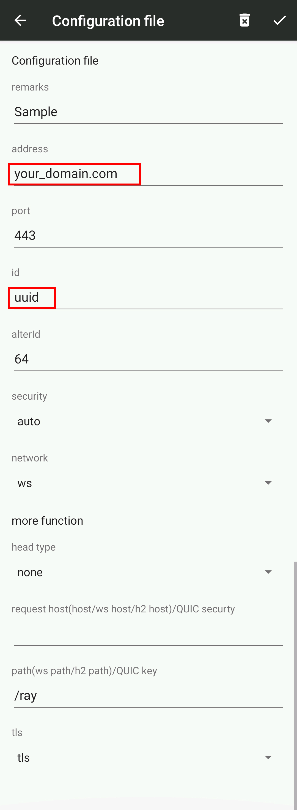

# A lightweight v2ray installation script (Lvis)
# 轻量级v2ray服务器端安装配置脚本
## Introduction
一个轻量级v2ray服务器端安装配置脚本（Lvis），搭建WebSocket+TLS+Web协议并开启bbr，简单纯净。
## Features
- 搭建主流的WebSocket+TLS+Web协议组合
- 使用nginx转发端口
- 自动开启bbr加速
- 除此之外没有任何其他功能，具体参阅源码
## Prerequisite
- 一个VPS服务器和指向服务器地址的域名，关于这个网上的教程有很多，在此不作讨论
- 脚本功能单一，目前仅支持**Ubuntu 18.04 Server**以上系统，其他Ubuntu版本未作测试

**使用前请测试域名能够正确解析到主机：**
```
ping your_domain.com
```
如果返回服务器地址证明解析成功。
## Installation steps
1. 脚本应以root权限运行，如果非root请使用`sudo su`进入root
2. 运行`bash <(curl -L -s https://git.io/JeAy1)`
3. 根据提示输入域名地址，**不需要“www”前缀**，例如`your_domain.com`
4. 安装配置完毕，最后一行黄色uuid即服务器uuid，复制粘贴即可
## Post process
客户端配置：
```
{
  "inbounds": [
    {
      "port": 1080,
      "listen": "127.0.0.1",
      "protocol": "socks",
      "sniffing": {
        "enabled": true,
        "destOverride": ["http", "tls"]
      },
      "settings": {
        "auth": "noauth",
        "udp": false
      }
    }
  ],
  "outbounds": [
    {
      "protocol": "vmess",
      "settings": {
        "vnext": [
          {
            "address": "your_domain.com",
            "port": 443,
            "users": [
              {
                "id": "uuid",
                "alterId": 64
              }
            ]
          }
        ]
      },
      "streamSettings": {
        "network": "ws",
        "security": "tls",
        "wsSettings": {
          "path": "/ray"
        }
      }
    }
  ]
}
```
替换`your_domain.com`和`uuid`即可。
## Android setup
Android v2rayNG配置：



替换`your_domain.com`和`uuid`即可。
## iOS setup
iOS Shadowrocket配置：


同样，替换`your_domain.com`和`uuid`即可。
## Others
- 成功安装后可考虑使用cloudflare的免费CDN隐藏服务器ip
- 提示：即便使用了CDN，被访问的网站还是能看到真实的服务器ip地址
- 如果要搭配Tor使用，请关闭客户端的流量混淆，将`sniffing`设置为`false`，v2rayNG/Shadowrocket同理
- 有问题请提交Issue反馈
